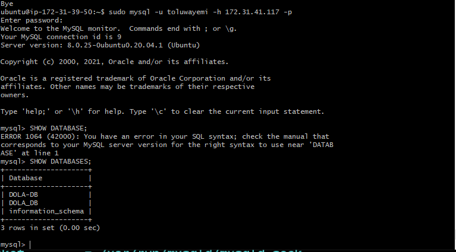

#  CLIENT/SERVER ARCHITECTURE USING A MYSQL RELATIONAL DATABASE MANAGEMENT SYSTEM
__To demonstrate a basic client-server using MySQL Relational Database Management System (RDBMS)__

* Create and configure two Linux-based virtual servers (EC2 instances in AWS) i.e `MySQL server` and `MySQL client`.
* On `mysql server` Linux Server install MySQL Server software.
* On `mysql client` Linux Server install MySQL Client software.
* Use `mysql server's` local IP address to connect from mysql client.
* MySQL server uses TCP port 3306 by default, so open it by creating a new entry in ‘Inbound rules’ in ‘mysql server’ Security Groups

* Configure MySQL server to allow connections from remote hosts.
* From mysql client Linux Server connect remotely to mysql server Database Engine without using SSH.

* Check that you have successfully connected to a remote MySQL server and can perform SQL queries
